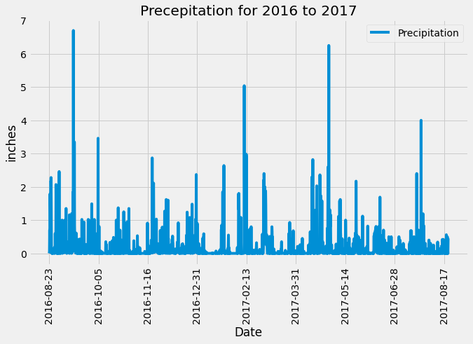
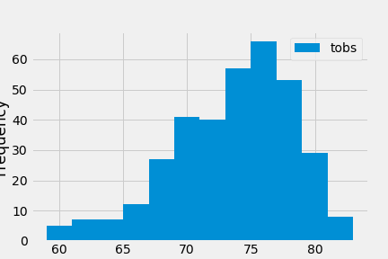

# sqlalchemy-challenge

## Instructions

You need to do climate analysis on the area highlighted in the sqlite file. 

### Part 1: Climate Analysis and Exploration

In this section, you’ll use Python and SQLAlchemy to perform basic climate analysis and data exploration of your climate database.

* Precipitation Analysis:

    - Find the most recent date in the dataset.
    - Using this date, retrieve the previous 12 months of precipitation data by querying the 12 previous months of data.
        - Select only the `date` and `prcp` values.
    - Load the query results into a Pandas DataFrame, and set the index to the date column.
    - Sort the DataFrame values by `date`.
    - Plot the results by using the DataFrame `plot` method (saved as .png files in images)
    - Use Pandas to print the summary statistics for the precipitation data.

* Station Analysis

    - Design a query to calculate the total number of stations in the dataset.
    - Design a query to find the most active stations (the stations with the most rows).
    - List the stations and observation counts in descending order.
        - Which station id has the highest number of observations?
    - Using the most active station id, calculate the lowest, highest, and average temperatures.
    - Design a query to retrieve the previous 12 months of temperature observation data (TOBS).
        - Filter by the station with the highest number of observations.
    - Query the previous 12 months of temperature observation data for this station.
    - Plot the results as a histogram with `bins=12` (saved as .png files in images)

- - -

### Part 2: Design Your Climate App

Now that you have completed your initial analysis, you’ll design a Flask API based on the queries that you have just developed.

Use Flask to create your routes, as follows:

* *`/`*
    * Homepage.
    * List all available routes.

* *`/api/v1.0/precipitation`*
    * Convert the query results to a dictionary using `date` as the key and `prcp` as the value.
    * Return the JSON representation of your dictionary.

* *`/api/v1.0/stations`*
    * Return a JSON list of stations from the dataset.

* *`/api/v1.0/tobs`*
    * Query the dates and temperature observations of the most active station for the previous year of data.
    * Return a JSON list of temperature observations (TOBS) for the previous year.

* *`/api/v1.0/<start>` and `/api/v1.0/<start>/<end>`*
    * Return a JSON list of the minimum temperature, the average temperature, and the maximum temperature for a given start or start-end range.
    * When given the start only, calculate `TMIN`, `TAVG`, and `TMAX` for all dates greater than or equal to the start date.
    * When given the start and the end date, calculate the `TMIN`, `TAVG`, and `TMAX` for dates from the start date through the end date (inclusive).

## Resources:
* https://stackoverflow.com/questions/45239261/matplotlib-savefig-text-chopped-off